# DFD — Data Flow Diagram
## KasKu: Personal Finance SaaS Platform

**Versi:** 2.0.0
**Tanggal:** 2026-04-27
**Author:** TubsAMY (admin@tubsamy.tech)
**Status:** DRAFT
**Changelog:** v2.0.0 — Pivot ke SaaS Microservices. Diagram direkonstruksi penuh dari arsitektur on-premise monolith ke 11 microservices multi-tenant dengan RabbitMQ event bus, gRPC inter-service, schema-per-tenant PostgreSQL, dan Midtrans payment integration.

---

## Daftar Isi

1. [Level 0 — Context Diagram](#1-level-0--context-diagram)
2. [Level 1 — System Overview](#2-level-1--system-overview)
3. [Level 2 — Detail Diagrams](#3-level-2--detail-diagrams)
   - [P1: Registrasi dan Autentikasi](#p1-registrasi-dan-autentikasi)
   - [P2: Subscription dan Payment](#p2-subscription-dan-payment)
   - [P3: Tenant Provisioning](#p3-tenant-provisioning)
   - [P4: Manajemen Akun Keuangan](#p4-manajemen-akun-keuangan)
   - [P5: Manajemen Investasi dan Harga](#p5-manajemen-investasi-dan-harga)
   - [P6: Pencatatan Transaksi](#p6-pencatatan-transaksi)
   - [P7: Offline Sync](#p7-offline-sync)
   - [P8: Notifikasi Email](#p8-notifikasi-email)
   - [P9: Admin Platform](#p9-admin-platform)
4. [Data Store Summary](#4-data-store-summary)
5. [Event Contract Summary](#5-event-contract-summary)

---

## 1. Level 0 — Context Diagram

Level 0 menampilkan KasKu sebagai black box dengan semua entitas eksternal yang berinteraksi dengannya.

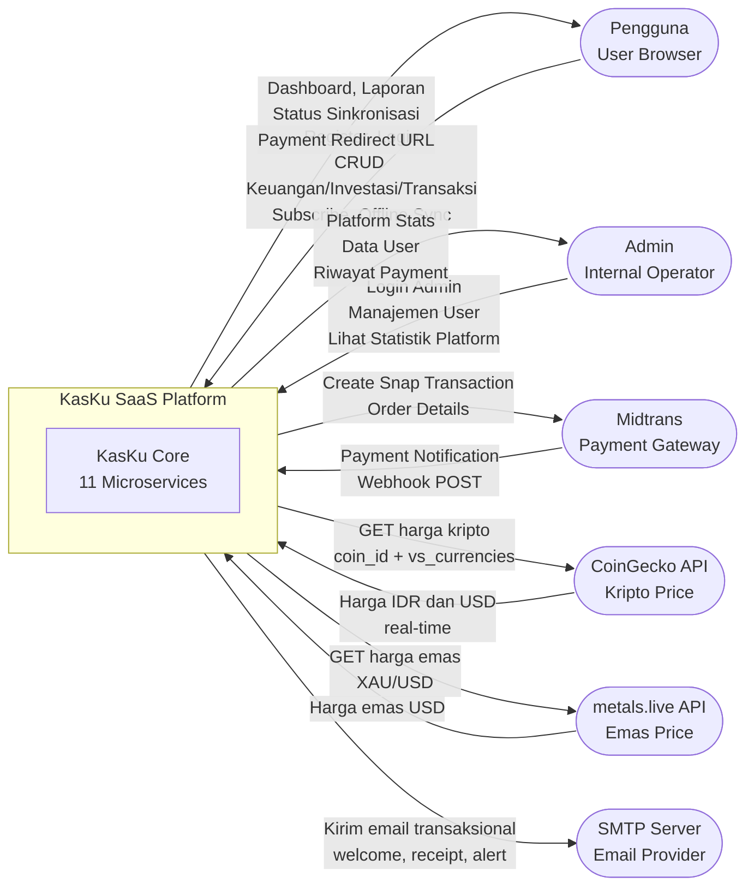

---

## 2. Level 1 — System Overview

Level 1 menampilkan semua 11 microservice, 5 database PostgreSQL, RabbitMQ, Redis, dan IndexedDB browser.

```mermaid
flowchart TB
    USER(["Pengguna"])
    ADMIN(["Admin"])

    subgraph BROWSER ["Browser — SvelteKit PWA"]
        BP1["P1: Auth UI\nregister, login, profile"]
        BP2["P2: Finance UI\nakun keuangan"]
        BP3["P3: Investment UI\ninstrumen investasi"]
        BP4["P4: Transaction UI\ntransaksi dan kategori"]
        BP5["P5: Billing UI\nsubscription dan invoice"]
        BP6["P6: Offline Sync Engine\nIndexedDB queue"]
        IDB[("IndexedDB\nDexie.js\nlocal mirror + sync queue")]
    end

    subgraph GATEWAY ["API Layer"]
        GW["api-gateway\n:8080\nRouting, JWT Verify\nRate Limit, CORS\nTier Header Inject"]
        REDIS_GW[("Redis :6379\nRate Limit\nJWT Blacklist")]
    end

    subgraph AUTH_LAYER ["Auth dan User Layer"]
        AUTH["auth-service\n:8081 HTTP / :9081 gRPC"]
        USR["user-service\n:8082 HTTP / :9082 gRPC"]
    end

    subgraph BILLING_LAYER ["Billing Layer"]
        BILL["billing-service\n:8083 HTTP / :9083 gRPC\nTier Limit gRPC Endpoint"]
    end

    subgraph FINANCE_LAYER ["Finance Layer"]
        FIN["finance-service\n:8084 HTTP / :9084 gRPC\nakun keuangan"]
        TRX["transaction-service\n:8085 HTTP / :9085 gRPC\ntransaksi dan kategori"]
        INV["investment-service\n:8086 HTTP / :9086 gRPC\ninstrumen investasi"]
    end

    subgraph INFRA_LAYER ["Infrastructure Layer"]
        PRICE["price-service Rust\n:8087 HTTP / :9087 gRPC\nreal-time price cache"]
        SYNC["sync-service Rust\n:8088 HTTP\noffline sync handler"]
        NOTIF["notification-service\n:8089 HTTP\nemail transaksional"]
    end

    subgraph ADMIN_LAYER ["Admin Layer — Internal Only"]
        ADM["admin-service\n:8090 HTTP\nplatform dashboard\nuser management"]
    end

    subgraph DATA_LAYER ["Data Layer"]
        DB_AUTH[("kasku_auth\nPostgreSQL\nusers, refresh_tokens\nemail_verifications")]
        DB_BILL[("kasku_billing\nPostgreSQL\nsubscription_plans\nsubscriptions, payments")]
        DB_FIN[("kasku_finance\nPostgreSQL\ntenant schemas\nper-tenant tables")]
        DB_PRICE[("kasku_price\nPostgreSQL\nprice_cache")]
        DB_ADM[("kasku_admin\nPostgreSQL\nadmin_users\nadmin_audit_log")]
        MQ[("RabbitMQ\nkasku.events exchange\ntopic type, durable\n+ DLX/DLQ")]
    end

    EXT_MIDTRANS(["Midtrans"])
    EXT_CG(["CoinGecko API"])
    EXT_ML(["metals.live API"])
    EXT_SMTP(["SMTP Server"])

    USER --> BROWSER
    BP1 & BP2 & BP3 & BP4 & BP5 --> GW
    BP6 <--> IDB
    BP6 <-- "batch push/pull\nsync operations" --> SYNC

    GW <--> REDIS_GW
    GW -- "JWT verify\nrouting" --> AUTH
    GW -- "routing" --> USR
    GW -- "routing" --> BILL
    GW -- "routing" --> FIN
    GW -- "routing" --> TRX
    GW -- "routing" --> INV
    GW -- "gRPC CheckTierLimit\nsebelum CREATE" --> BILL

    AUTH <--> DB_AUTH
    AUTH -- "publish user.registered" --> MQ

    USR <--> DB_AUTH
    USR -- "provision_tenant()\nwrite DDL" --> DB_FIN
    USR -- "consume user.registered\nconsume user.deletion_requested" --> MQ

    BILL <--> DB_BILL
    BILL -- "create transaction\nSnap API" --> EXT_MIDTRANS
    EXT_MIDTRANS -- "webhook\npayment.succeeded\npayment.failed" --> GW
    BILL -- "publish payment.succeeded\npublish payment.failed\npublish subscription events" --> MQ
    BILL -- "consume payment.succeeded\nconsume subscription.expired" --> MQ

    FIN <--> DB_FIN
    TRX <--> DB_FIN
    INV <--> DB_FIN
    INV -- "gRPC GetPrice" --> PRICE

    PRICE <--> DB_PRICE
    PRICE -- "GET kripto price" --> EXT_CG
    PRICE -- "GET emas price" --> EXT_ML

    SYNC <--> DB_FIN

    NOTIF -- "consume all events" --> MQ
    NOTIF -- "send email" --> EXT_SMTP

    ADMIN --> ADM
    ADM <--> DB_ADM
    ADM -- "read user data\nread billing data" --> DB_AUTH
    ADM -- "read payment data\nread subscription data" --> DB_BILL
```

---

## 3. Level 2 — Detail Diagrams

### P1: Registrasi dan Autentikasi

Alur lengkap dari register hingga reset password, termasuk verifikasi email dan brute force protection.

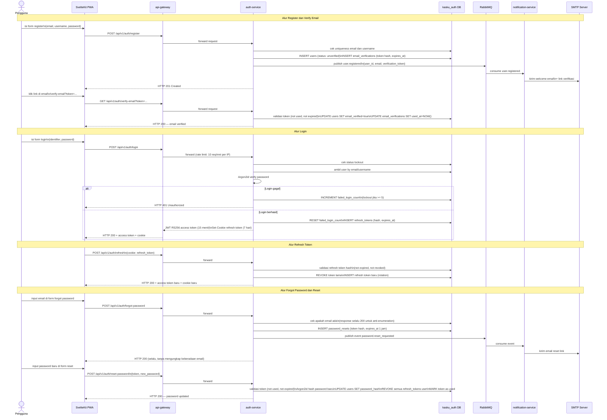

---

### P2: Subscription dan Payment

Alur subscribe ke plan berbayar via Midtrans Snap, webhook handling, dan aktivasi subscription.

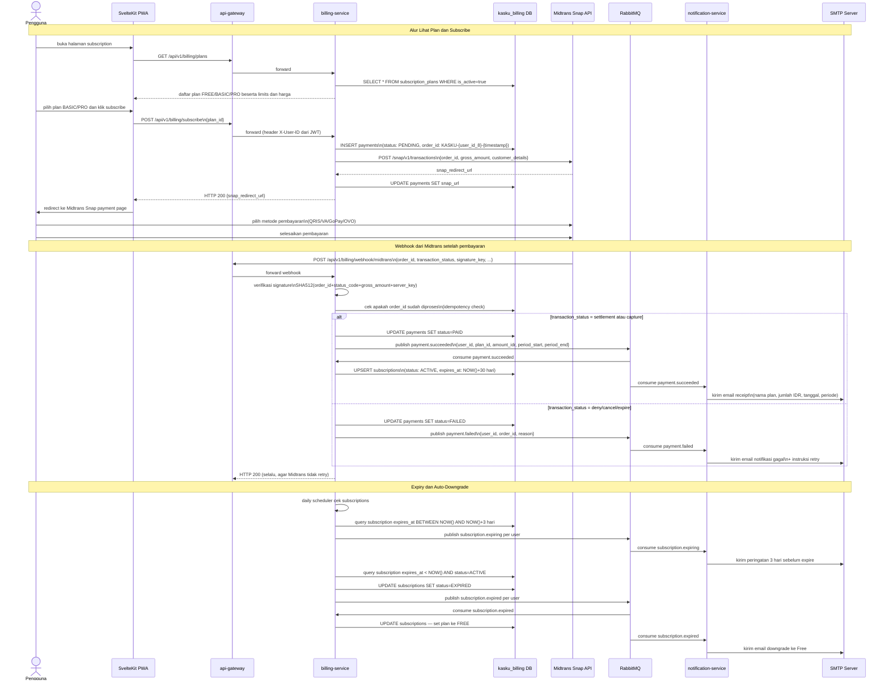

---

### P3: Tenant Provisioning

Alur event-driven dari registrasi pengguna hingga tenant schema siap digunakan.

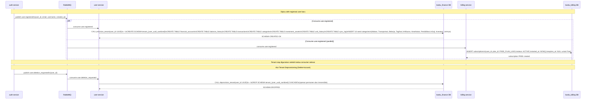

---

### P4: Manajemen Akun Keuangan

Alur CRUD akun keuangan dengan enforcement tier limit via billing-service gRPC.

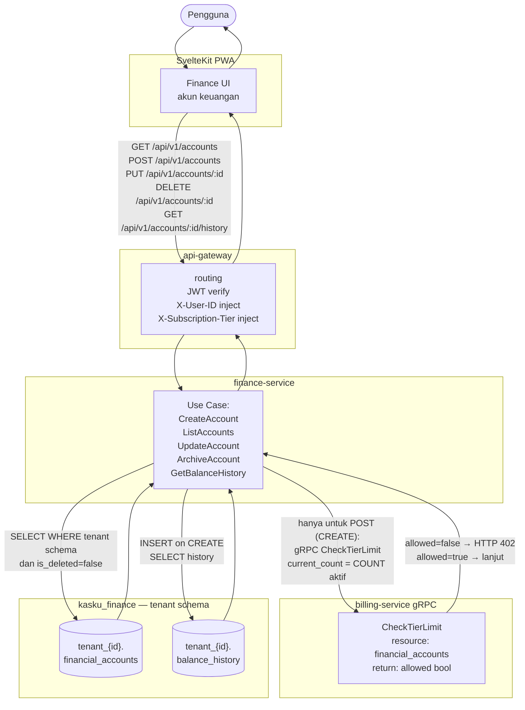

---

### P5: Manajemen Investasi dan Harga

Alur CRUD instrumen investasi dengan tier limit check dan pengambilan harga real-time via price-service gRPC.

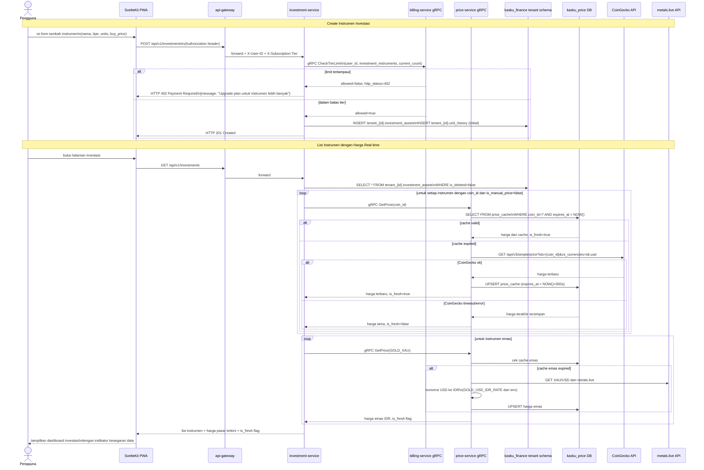

---

### P6: Pencatatan Transaksi

Alur CRUD transaksi dengan enforcement quota bulanan dan soft delete.

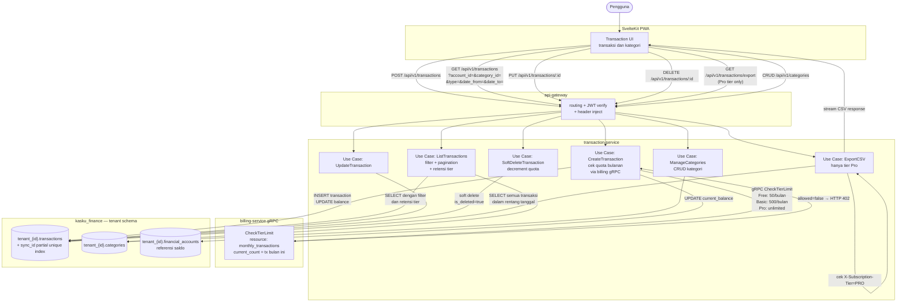

---

### P7: Offline Sync

Alur sinkronisasi data antara IndexedDB browser dan server, termasuk conflict resolution Server Wins.

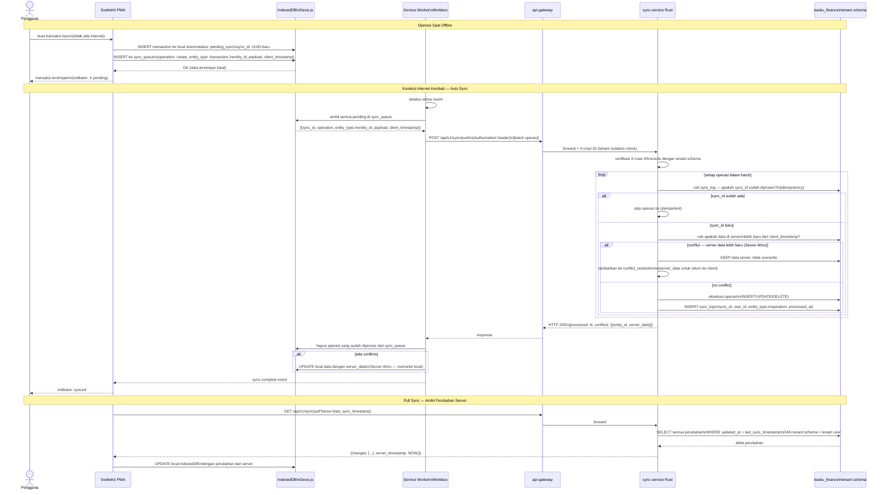

---

### P8: Notifikasi Email

Alur event-driven penuh — semua 7 tipe event RabbitMQ dan email yang dikirim.

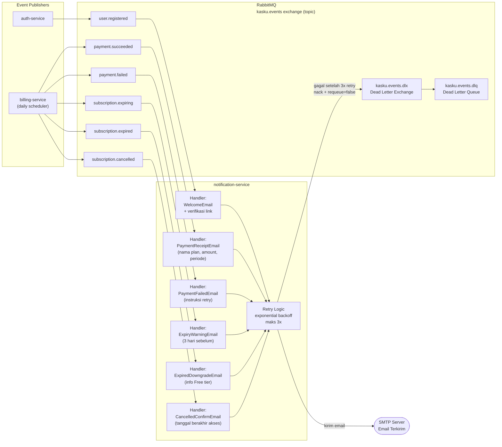

---

### P9: Admin Platform

Alur admin login dan operasi platform management yang hanya dapat diakses dari jaringan internal.

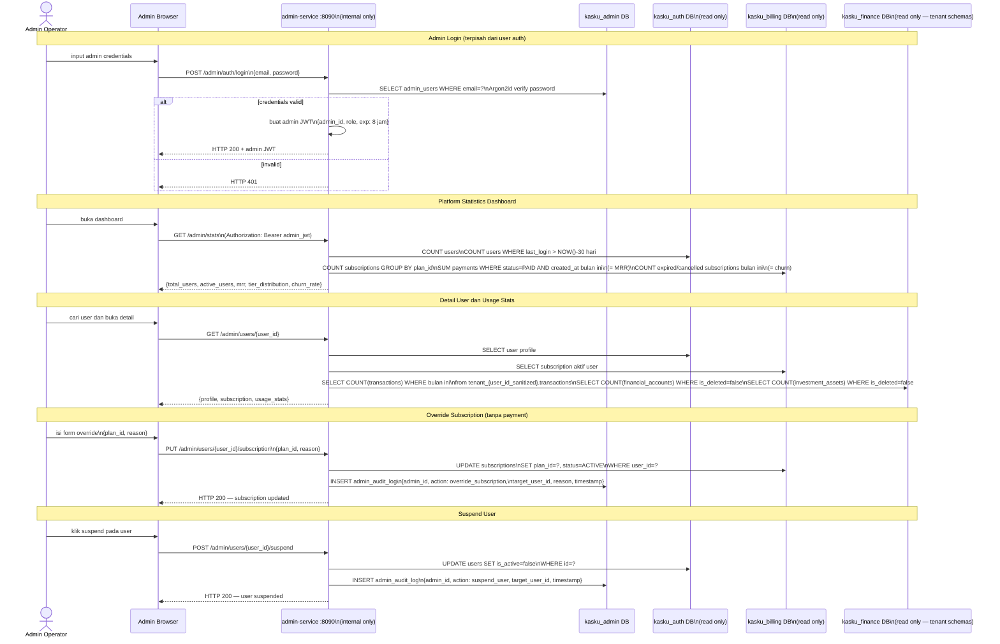

---

## 4. Data Store Summary

| ID | Nama Store | Service Owner | Database | Teknologi | Deskripsi |
|----|-----------|---------------|----------|-----------|-----------|
| D1 | users | auth-service | kasku_auth | PostgreSQL | Kredensial dan status user (email_verified, is_active, failed_login_count, lockout_until) |
| D2 | refresh_tokens | auth-service | kasku_auth | PostgreSQL | Refresh token aktif (hash SHA-256, expires_at, revoked_at) |
| D3 | email_verifications | auth-service | kasku_auth | PostgreSQL | Token verifikasi email (hash, expires_at, used_at) |
| D4 | password_resets | auth-service | kasku_auth | PostgreSQL | Token reset password (hash, expires_at, used_at) |
| D5 | subscription_plans | billing-service | kasku_billing | PostgreSQL | Definisi plan FREE/BASIC/PRO beserta limits dan harga |
| D6 | subscriptions | billing-service | kasku_billing | PostgreSQL | Subscription aktif per user (plan_id, status, started_at, expires_at) |
| D7 | payments | billing-service | kasku_billing | PostgreSQL | Riwayat payment (midtrans_order_id, status, amount_idr, snap_url) |
| D8 | tenant_{id}.financial_accounts | finance-service | kasku_finance | PostgreSQL (tenant schema) | Akun keuangan per tenant (name, type, currency, is_deleted) |
| D9 | tenant_{id}.balance_history | finance-service | kasku_finance | PostgreSQL (tenant schema) | Riwayat perubahan saldo (append-only audit log) |
| D10 | tenant_{id}.investment_assets | investment-service | kasku_finance | PostgreSQL (tenant schema) | Instrumen investasi per tenant (name, type, units, coin_id, is_deleted) |
| D11 | tenant_{id}.unit_history | investment-service | kasku_finance | PostgreSQL (tenant schema) | Riwayat perubahan unit (append-only audit log) |
| D12 | tenant_{id}.transactions | transaction-service | kasku_finance | PostgreSQL (tenant schema) | Transaksi keuangan per tenant (type, amount, date, sync_id, is_deleted) |
| D13 | tenant_{id}.categories | transaction-service | kasku_finance | PostgreSQL (tenant schema) | Kategori transaksi per tenant (seed + custom, is_deleted) |
| D14 | tenant_{id}.sync_log | sync-service | kasku_finance | PostgreSQL (tenant schema) | Audit log operasi sync (sync_id, operation, entity_type, processed_at) |
| D15 | price_cache | price-service | kasku_price | PostgreSQL | Cache harga aset (coin_id, price_idr, price_usd, expires_at) |
| D16 | admin_users | admin-service | kasku_admin | PostgreSQL | Kredensial admin platform (email, password_hash Argon2id, role) |
| D17 | admin_audit_log | admin-service | kasku_admin | PostgreSQL | Log aksi admin ke data user (admin_id, action, target_user_id, reason, timestamp) |
| D18 | kasku.events (RabbitMQ) | Multiple publishers | RabbitMQ | AMQP 0-9-1 | Async event bus — topic exchange durable |
| D19 | kasku.events.dlq (RabbitMQ) | notification-service | RabbitMQ | AMQP 0-9-1 | Dead Letter Queue untuk failed events setelah retry maksimal |
| D20 | rate_limit (Redis) | api-gateway | Redis | Redis ≥7 | Counter rate limit per IP dan per user_id |
| D21 | jwt_blacklist (Redis) | api-gateway | Redis | Redis ≥7 | Token JWT yang sudah di-logout (key=token hash, TTL=sisa waktu valid) |
| IDB | IndexedDB | Frontend (browser) | Browser | Dexie.js ≥4.0 | Mirror lokal data tenant + sync_queue untuk operasi offline |

---

## 5. Event Contract Summary

Exchange: `kasku.events` (topic type, durable)
Format routing key: `{domain}.{action}` (lowercase)

| Event | Routing Key | Publisher | Consumer(s) | Payload Fields |
|-------|-------------|-----------|-------------|----------------|
| User Registered | `user.registered` | auth-service | user-service, billing-service, notification-service | `user_id`, `email`, `username`, `created_at`, `verification_token` |
| User Deletion Requested | `user.deletion_requested` | user-service | user-service | `user_id`, `requested_at` |
| Payment Succeeded | `payment.succeeded` | billing-service | billing-service, notification-service | `user_id`, `plan_id`, `plan_name`, `amount_idr`, `payment_method`, `period_start`, `period_end` |
| Payment Failed | `payment.failed` | billing-service | notification-service | `user_id`, `order_id`, `reason`, `failed_at` |
| Subscription Expiring | `subscription.expiring` | billing-service (scheduler) | notification-service | `user_id`, `email`, `plan_name`, `expires_at` |
| Subscription Expired | `subscription.expired` | billing-service (scheduler) | billing-service, notification-service | `user_id`, `email`, `previous_plan`, `expired_at` |
| Subscription Cancelled | `subscription.cancelled` | billing-service | notification-service | `user_id`, `email`, `plan_name`, `access_until` |

**Dead Letter Policy:**
- DLX: `kasku.events.dlx`
- DLQ: `kasku.events.dlq`
- Trigger: message di-nack dengan requeue=false setelah 3 kali retry di notification-service
- Action: pesan tersimpan di DLQ untuk investigasi manual oleh operator

---

*Dokumen DFD ini merupakan panduan visual untuk alur data sistem KasKu v2.0. Untuk detail schema database, lihat `databaseScheme.md`. Untuk detail endpoint, lihat `ApiSpecOpenAPI.yaml`. Untuk keputusan arsitektur, lihat `Arsitektur.md`.*
