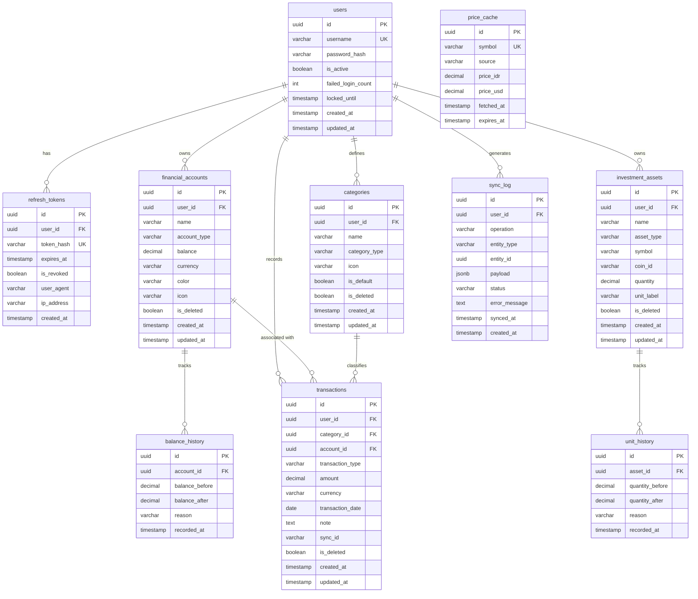

# ERD — Entity Relationship Diagram
## KasKu: Personal Finance Tracker

**Versi:** 1.0.0  
**Tanggal:** 2026-04-22  

---

## Entity Relationship Diagram



---

## Definisi Entitas & Kolom

### users

| Kolom | Tipe | Constraint | Keterangan |
|---|---|---|---|
| id | UUID | PK, NOT NULL | Primary key, generated |
| username | VARCHAR(50) | UNIQUE, NOT NULL | Username login |
| password_hash | VARCHAR(255) | NOT NULL | Argon2id hash |
| is_active | BOOLEAN | NOT NULL, DEFAULT true | Status akun |
| failed_login_count | INT | NOT NULL, DEFAULT 0 | Counter gagal login |
| locked_until | TIMESTAMP | NULL | Lockout timestamp |
| created_at | TIMESTAMP | NOT NULL, DEFAULT NOW() | Waktu dibuat |
| updated_at | TIMESTAMP | NOT NULL, DEFAULT NOW() | Waktu diperbarui |

---

### refresh_tokens

| Kolom | Tipe | Constraint | Keterangan |
|---|---|---|---|
| id | UUID | PK | Primary key |
| user_id | UUID | FK → users.id | Pemilik token |
| token_hash | VARCHAR(255) | UNIQUE, NOT NULL | Hash dari refresh token |
| expires_at | TIMESTAMP | NOT NULL | Waktu kadaluarsa |
| is_revoked | BOOLEAN | NOT NULL, DEFAULT false | Apakah sudah dicabut |
| user_agent | VARCHAR(255) | NULL | Browser info |
| ip_address | VARCHAR(45) | NULL | IP saat login |
| created_at | TIMESTAMP | NOT NULL, DEFAULT NOW() | Waktu dibuat |

---

### financial_accounts

| Kolom | Tipe | Constraint | Keterangan |
|---|---|---|---|
| id | UUID | PK | Primary key |
| user_id | UUID | FK → users.id | Pemilik akun |
| name | VARCHAR(100) | NOT NULL | Nama akun (BCA, Seabank, dll.) |
| account_type | VARCHAR(20) | NOT NULL | ENUM: BANK, EWALLET, CASH |
| balance | DECIMAL(20,2) | NOT NULL, DEFAULT 0 | Saldo saat ini |
| currency | VARCHAR(3) | NOT NULL, DEFAULT 'IDR' | Mata uang |
| color | VARCHAR(7) | NULL | Warna hex (#RRGGBB) |
| icon | VARCHAR(50) | NULL | Nama ikon |
| is_deleted | BOOLEAN | NOT NULL, DEFAULT false | Soft delete flag |
| created_at | TIMESTAMP | NOT NULL, DEFAULT NOW() | |
| updated_at | TIMESTAMP | NOT NULL, DEFAULT NOW() | |

**Index:** `(user_id, is_deleted)`, `(user_id, name)` UNIQUE WHERE NOT is_deleted

---

### balance_history

| Kolom | Tipe | Constraint | Keterangan |
|---|---|---|---|
| id | UUID | PK | Primary key |
| account_id | UUID | FK → financial_accounts.id | Akun terkait |
| balance_before | DECIMAL(20,2) | NOT NULL | Saldo sebelum perubahan |
| balance_after | DECIMAL(20,2) | NOT NULL | Saldo setelah perubahan |
| reason | VARCHAR(100) | NULL | Alasan perubahan (MANUAL_UPDATE, dsb.) |
| recorded_at | TIMESTAMP | NOT NULL, DEFAULT NOW() | Waktu snapshot |

**Index:** `(account_id, recorded_at DESC)`

---

### investment_assets

| Kolom | Tipe | Constraint | Keterangan |
|---|---|---|---|
| id | UUID | PK | Primary key |
| user_id | UUID | FK → users.id | Pemilik aset |
| name | VARCHAR(100) | NOT NULL | Nama tampilan (Emas Antam, Bitcoin) |
| asset_type | VARCHAR(20) | NOT NULL | ENUM: GOLD, CRYPTO, STOCK, OTHER |
| symbol | VARCHAR(20) | NOT NULL | Simbol pasar (XAU, BTC, ETH) |
| coin_id | VARCHAR(50) | NULL | CoinGecko coin ID (khusus CRYPTO) |
| quantity | DECIMAL(30,10) | NOT NULL, DEFAULT 0 | Jumlah unit |
| unit_label | VARCHAR(20) | NOT NULL | Satuan (gram, BTC, coin, lot) |
| is_deleted | BOOLEAN | NOT NULL, DEFAULT false | Soft delete flag |
| created_at | TIMESTAMP | NOT NULL, DEFAULT NOW() | |
| updated_at | TIMESTAMP | NOT NULL, DEFAULT NOW() | |

**Index:** `(user_id, is_deleted)`, `(symbol)`

---

### unit_history

| Kolom | Tipe | Constraint | Keterangan |
|---|---|---|---|
| id | UUID | PK | Primary key |
| asset_id | UUID | FK → investment_assets.id | Aset terkait |
| quantity_before | DECIMAL(30,10) | NOT NULL | Jumlah sebelum |
| quantity_after | DECIMAL(30,10) | NOT NULL | Jumlah sesudah |
| reason | VARCHAR(100) | NULL | Alasan perubahan |
| recorded_at | TIMESTAMP | NOT NULL, DEFAULT NOW() | Waktu snapshot |

---

### price_cache

| Kolom | Tipe | Constraint | Keterangan |
|---|---|---|---|
| id | UUID | PK | Primary key |
| symbol | VARCHAR(20) | UNIQUE, NOT NULL | Simbol aset (BTC, XAU) |
| source | VARCHAR(50) | NOT NULL | API sumber (coingecko, metals.live) |
| price_idr | DECIMAL(30,2) | NULL | Harga dalam IDR |
| price_usd | DECIMAL(30,6) | NULL | Harga dalam USD |
| fetched_at | TIMESTAMP | NOT NULL | Waktu fetch |
| expires_at | TIMESTAMP | NOT NULL | Waktu expired (fetched_at + 15 menit) |

---

### categories

| Kolom | Tipe | Constraint | Keterangan |
|---|---|---|---|
| id | UUID | PK | Primary key |
| user_id | UUID | FK → users.id | Pemilik kategori |
| name | VARCHAR(100) | NOT NULL | Nama kategori |
| category_type | VARCHAR(10) | NOT NULL | ENUM: INCOME, EXPENSE, BOTH |
| icon | VARCHAR(50) | NULL | Ikon |
| is_default | BOOLEAN | NOT NULL, DEFAULT false | Kategori bawaan sistem |
| is_deleted | BOOLEAN | NOT NULL, DEFAULT false | Soft delete flag |
| created_at | TIMESTAMP | NOT NULL, DEFAULT NOW() | |
| updated_at | TIMESTAMP | NOT NULL, DEFAULT NOW() | |

**Index:** `(user_id, is_deleted)`, `(user_id, name)` UNIQUE WHERE NOT is_deleted

**Default Categories (seed):**

| Nama | Tipe |
|---|---|
| Gaji | INCOME |
| Freelance | INCOME |
| Bonus | INCOME |
| Investasi Masuk | INCOME |
| Makan & Minum | EXPENSE |
| Transport | EXPENSE |
| Belanja | EXPENSE |
| Tagihan & Utilitas | EXPENSE |
| Hiburan | EXPENSE |
| Kesehatan | EXPENSE |
| Pendidikan | EXPENSE |
| Lain-lain | BOTH |

---

### transactions

| Kolom | Tipe | Constraint | Keterangan |
|---|---|---|---|
| id | UUID | PK | Primary key |
| user_id | UUID | FK → users.id | Pemilik |
| category_id | UUID | FK → categories.id | Kategori |
| account_id | UUID | FK → financial_accounts.id, NULL | Akun terkait (opsional) |
| transaction_type | VARCHAR(10) | NOT NULL | ENUM: INCOME, EXPENSE |
| amount | DECIMAL(20,2) | NOT NULL, CHECK > 0 | Nominal |
| currency | VARCHAR(3) | NOT NULL, DEFAULT 'IDR' | Mata uang |
| transaction_date | DATE | NOT NULL | Tanggal transaksi |
| note | TEXT | NULL, MAX 500 chars | Catatan opsional |
| sync_id | VARCHAR(36) | NULL | UUID dari sisi client (idempotency key) |
| is_deleted | BOOLEAN | NOT NULL, DEFAULT false | Soft delete flag |
| created_at | TIMESTAMP | NOT NULL, DEFAULT NOW() | |
| updated_at | TIMESTAMP | NOT NULL, DEFAULT NOW() | |

**Index:** `(user_id, transaction_date DESC)`, `(user_id, category_id)`, `(user_id, transaction_type)`, `(sync_id)` UNIQUE WHERE NOT NULL

---

### sync_log

| Kolom | Tipe | Constraint | Keterangan |
|---|---|---|---|
| id | UUID | PK | Primary key |
| user_id | UUID | FK → users.id | Pemilik |
| operation | VARCHAR(10) | NOT NULL | ENUM: CREATE, UPDATE, DELETE |
| entity_type | VARCHAR(50) | NOT NULL | transactions, financial_accounts, dll. |
| entity_id | UUID | NOT NULL | ID entitas yang dioperasikan |
| payload | JSONB | NULL | Payload operasi |
| status | VARCHAR(10) | NOT NULL | ENUM: SUCCESS, FAILED, CONFLICT |
| error_message | TEXT | NULL | Pesan error jika gagal |
| synced_at | TIMESTAMP | NULL | Waktu sync berhasil |
| created_at | TIMESTAMP | NOT NULL, DEFAULT NOW() | |

**Index:** `(user_id, created_at DESC)`, `(entity_id, entity_type)`

---

## Database Schema SQL (PostgreSQL)

```sql
-- Enable UUID generation
CREATE EXTENSION IF NOT EXISTS "pgcrypto";

-- Users
CREATE TABLE users (
    id UUID PRIMARY KEY DEFAULT gen_random_uuid(),
    username VARCHAR(50) UNIQUE NOT NULL,
    password_hash VARCHAR(255) NOT NULL,
    is_active BOOLEAN NOT NULL DEFAULT true,
    failed_login_count INT NOT NULL DEFAULT 0,
    locked_until TIMESTAMP WITH TIME ZONE,
    created_at TIMESTAMP WITH TIME ZONE NOT NULL DEFAULT NOW(),
    updated_at TIMESTAMP WITH TIME ZONE NOT NULL DEFAULT NOW()
);

-- Refresh Tokens
CREATE TABLE refresh_tokens (
    id UUID PRIMARY KEY DEFAULT gen_random_uuid(),
    user_id UUID NOT NULL REFERENCES users(id) ON DELETE CASCADE,
    token_hash VARCHAR(255) UNIQUE NOT NULL,
    expires_at TIMESTAMP WITH TIME ZONE NOT NULL,
    is_revoked BOOLEAN NOT NULL DEFAULT false,
    user_agent VARCHAR(255),
    ip_address VARCHAR(45),
    created_at TIMESTAMP WITH TIME ZONE NOT NULL DEFAULT NOW()
);
CREATE INDEX idx_refresh_tokens_user_id ON refresh_tokens(user_id);

-- Financial Accounts
CREATE TABLE financial_accounts (
    id UUID PRIMARY KEY DEFAULT gen_random_uuid(),
    user_id UUID NOT NULL REFERENCES users(id) ON DELETE RESTRICT,
    name VARCHAR(100) NOT NULL,
    account_type VARCHAR(20) NOT NULL CHECK (account_type IN ('BANK', 'EWALLET', 'CASH')),
    balance DECIMAL(20,2) NOT NULL DEFAULT 0,
    currency VARCHAR(3) NOT NULL DEFAULT 'IDR',
    color VARCHAR(7),
    icon VARCHAR(50),
    is_deleted BOOLEAN NOT NULL DEFAULT false,
    created_at TIMESTAMP WITH TIME ZONE NOT NULL DEFAULT NOW(),
    updated_at TIMESTAMP WITH TIME ZONE NOT NULL DEFAULT NOW()
);
CREATE INDEX idx_fa_user_active ON financial_accounts(user_id, is_deleted);
CREATE UNIQUE INDEX idx_fa_user_name ON financial_accounts(user_id, name) WHERE NOT is_deleted;

-- Balance History
CREATE TABLE balance_history (
    id UUID PRIMARY KEY DEFAULT gen_random_uuid(),
    account_id UUID NOT NULL REFERENCES financial_accounts(id) ON DELETE RESTRICT,
    balance_before DECIMAL(20,2) NOT NULL,
    balance_after DECIMAL(20,2) NOT NULL,
    reason VARCHAR(100),
    recorded_at TIMESTAMP WITH TIME ZONE NOT NULL DEFAULT NOW()
);
CREATE INDEX idx_bh_account_date ON balance_history(account_id, recorded_at DESC);

-- Investment Assets
CREATE TABLE investment_assets (
    id UUID PRIMARY KEY DEFAULT gen_random_uuid(),
    user_id UUID NOT NULL REFERENCES users(id) ON DELETE RESTRICT,
    name VARCHAR(100) NOT NULL,
    asset_type VARCHAR(20) NOT NULL CHECK (asset_type IN ('GOLD', 'CRYPTO', 'STOCK', 'OTHER')),
    symbol VARCHAR(20) NOT NULL,
    coin_id VARCHAR(50),
    quantity DECIMAL(30,10) NOT NULL DEFAULT 0,
    unit_label VARCHAR(20) NOT NULL,
    is_deleted BOOLEAN NOT NULL DEFAULT false,
    created_at TIMESTAMP WITH TIME ZONE NOT NULL DEFAULT NOW(),
    updated_at TIMESTAMP WITH TIME ZONE NOT NULL DEFAULT NOW()
);
CREATE INDEX idx_ia_user_active ON investment_assets(user_id, is_deleted);

-- Unit History
CREATE TABLE unit_history (
    id UUID PRIMARY KEY DEFAULT gen_random_uuid(),
    asset_id UUID NOT NULL REFERENCES investment_assets(id) ON DELETE RESTRICT,
    quantity_before DECIMAL(30,10) NOT NULL,
    quantity_after DECIMAL(30,10) NOT NULL,
    reason VARCHAR(100),
    recorded_at TIMESTAMP WITH TIME ZONE NOT NULL DEFAULT NOW()
);
CREATE INDEX idx_uh_asset_date ON unit_history(asset_id, recorded_at DESC);

-- Price Cache
CREATE TABLE price_cache (
    id UUID PRIMARY KEY DEFAULT gen_random_uuid(),
    symbol VARCHAR(20) UNIQUE NOT NULL,
    source VARCHAR(50) NOT NULL,
    price_idr DECIMAL(30,2),
    price_usd DECIMAL(30,6),
    fetched_at TIMESTAMP WITH TIME ZONE NOT NULL,
    expires_at TIMESTAMP WITH TIME ZONE NOT NULL
);

-- Categories
CREATE TABLE categories (
    id UUID PRIMARY KEY DEFAULT gen_random_uuid(),
    user_id UUID NOT NULL REFERENCES users(id) ON DELETE RESTRICT,
    name VARCHAR(100) NOT NULL,
    category_type VARCHAR(10) NOT NULL CHECK (category_type IN ('INCOME', 'EXPENSE', 'BOTH')),
    icon VARCHAR(50),
    is_default BOOLEAN NOT NULL DEFAULT false,
    is_deleted BOOLEAN NOT NULL DEFAULT false,
    created_at TIMESTAMP WITH TIME ZONE NOT NULL DEFAULT NOW(),
    updated_at TIMESTAMP WITH TIME ZONE NOT NULL DEFAULT NOW()
);
CREATE INDEX idx_cat_user_active ON categories(user_id, is_deleted);
CREATE UNIQUE INDEX idx_cat_user_name ON categories(user_id, name) WHERE NOT is_deleted;

-- Transactions
CREATE TABLE transactions (
    id UUID PRIMARY KEY DEFAULT gen_random_uuid(),
    user_id UUID NOT NULL REFERENCES users(id) ON DELETE RESTRICT,
    category_id UUID NOT NULL REFERENCES categories(id) ON DELETE RESTRICT,
    account_id UUID REFERENCES financial_accounts(id) ON DELETE SET NULL,
    transaction_type VARCHAR(10) NOT NULL CHECK (transaction_type IN ('INCOME', 'EXPENSE')),
    amount DECIMAL(20,2) NOT NULL CHECK (amount > 0),
    currency VARCHAR(3) NOT NULL DEFAULT 'IDR',
    transaction_date DATE NOT NULL,
    note TEXT CHECK (char_length(note) <= 500),
    sync_id VARCHAR(36),
    is_deleted BOOLEAN NOT NULL DEFAULT false,
    created_at TIMESTAMP WITH TIME ZONE NOT NULL DEFAULT NOW(),
    updated_at TIMESTAMP WITH TIME ZONE NOT NULL DEFAULT NOW()
);
CREATE INDEX idx_trx_user_date ON transactions(user_id, transaction_date DESC);
CREATE INDEX idx_trx_user_cat ON transactions(user_id, category_id);
CREATE INDEX idx_trx_user_type ON transactions(user_id, transaction_type);
CREATE UNIQUE INDEX idx_trx_sync_id ON transactions(sync_id) WHERE sync_id IS NOT NULL;

-- Sync Log
CREATE TABLE sync_log (
    id UUID PRIMARY KEY DEFAULT gen_random_uuid(),
    user_id UUID NOT NULL REFERENCES users(id) ON DELETE CASCADE,
    operation VARCHAR(10) NOT NULL CHECK (operation IN ('CREATE', 'UPDATE', 'DELETE')),
    entity_type VARCHAR(50) NOT NULL,
    entity_id UUID NOT NULL,
    payload JSONB,
    status VARCHAR(10) NOT NULL CHECK (status IN ('SUCCESS', 'FAILED', 'CONFLICT')),
    error_message TEXT,
    synced_at TIMESTAMP WITH TIME ZONE,
    created_at TIMESTAMP WITH TIME ZONE NOT NULL DEFAULT NOW()
);
CREATE INDEX idx_sync_user_date ON sync_log(user_id, created_at DESC);
```
