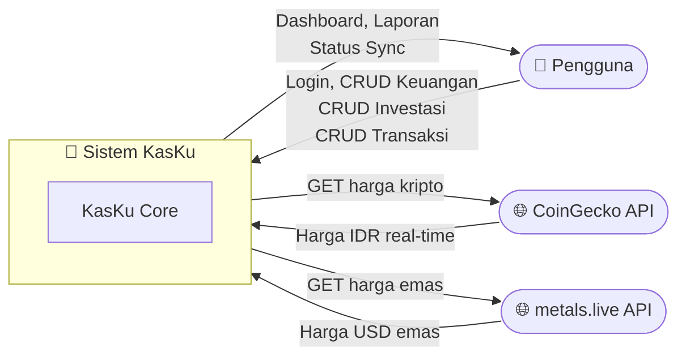
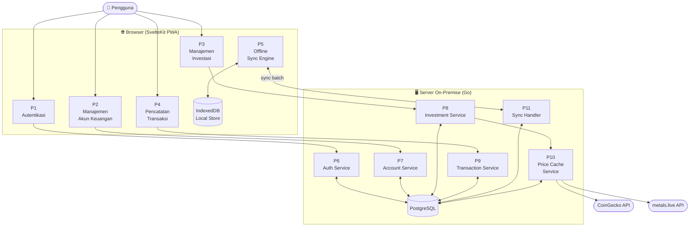
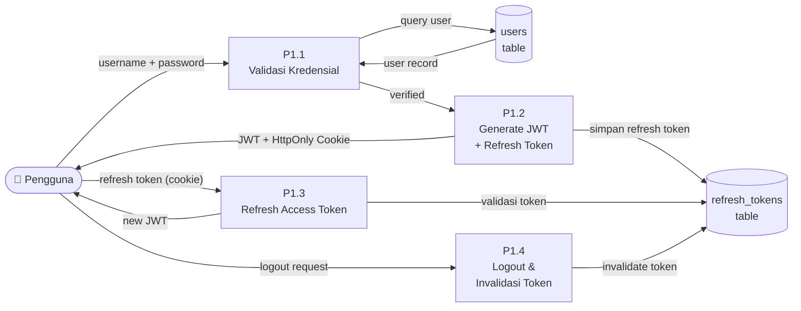
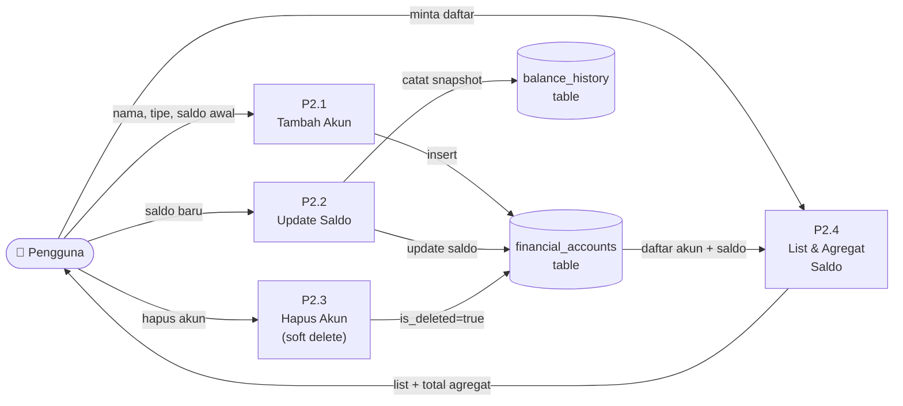
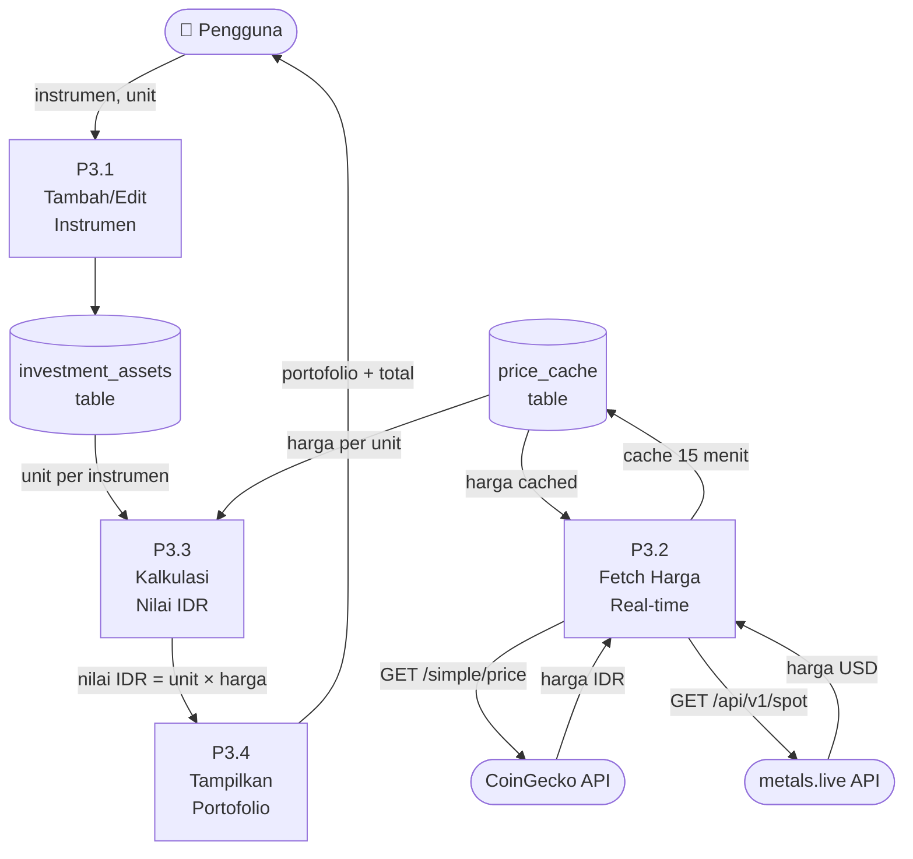
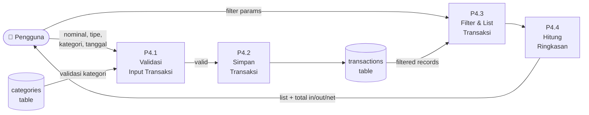
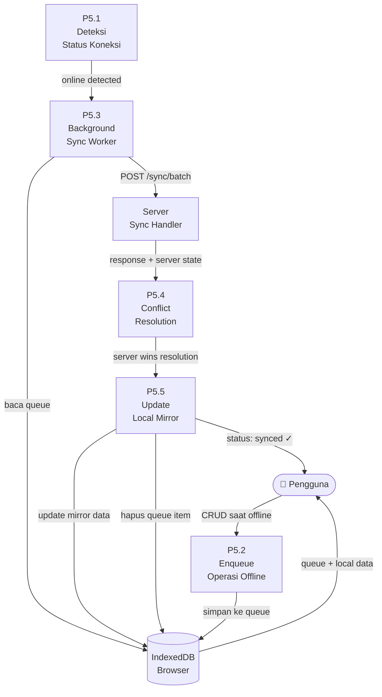

# DFD — Data Flow Diagram
## KasKu: Personal Finance Tracker

**Versi:** 1.0.0  
**Tanggal:** 2026-04-22  

---

## Level 0 — Context Diagram

Diagram konteks menunjukkan KasKu sebagai sistem tunggal dengan entitas eksternal yang berinteraksi dengannya.

---

## Level 1 — System Overview

Menunjukkan proses-proses utama di dalam sistem KasKu.

---

## Level 2 — P1: Proses Autentikasi

---

## Level 2 — P2: Proses Manajemen Akun Keuangan

---

## Level 2 — P3: Proses Manajemen Investasi & Harga

---

## Level 2 — P4: Proses Pencatatan Transaksi

---

## Level 2 — P5: Proses Offline Sync

---

## Data Store Summary

| Data Store | Lokasi | Teknologi | Deskripsi |
|---|---|---|---|
| D1: users | Server | PostgreSQL | Kredensial pengguna |
| D2: refresh_tokens | Server | PostgreSQL | Token refresh aktif |
| D3: financial_accounts | Server | PostgreSQL | Akun keuangan |
| D4: balance_history | Server | PostgreSQL | Riwayat perubahan saldo |
| D5: investment_assets | Server | PostgreSQL | Instrumen dan unit investasi |
| D6: price_cache | Server | PostgreSQL / Memory | Cache harga real-time |
| D7: transactions | Server | PostgreSQL | Semua transaksi |
| D8: categories | Server | PostgreSQL | Kategori transaksi |
| IDB: IndexedDB | Browser | Dexie.js | Mirror data + sync queue |
