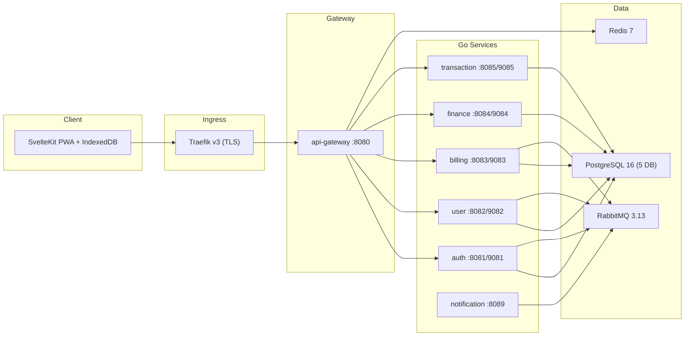
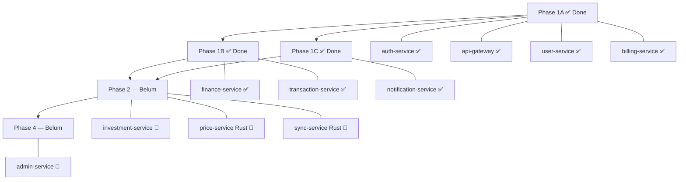

# KasKu SaaS — Workspace Exploration Walkthrough

## Ringkasan Proyek

**KasKu** adalah platform SaaS manajemen keuangan pribadi multi-tenant untuk pengguna Indonesia. Platform ini memungkinkan pengguna mencatat, memantau, dan menganalisis keuangan mereka — termasuk rekening bank, aset investasi (kripto, emas, reksa dana, saham), dan transaksi harian — dalam satu dashboard terpusat.

---

## Struktur Workspace

```
kasku/
├── Plan/                      # 📋 Dokumen perencanaan lengkap
├── Knowledge/                 # 📚 Referensi arsitektur & patterns
├── kasku-backend/             # ⚙️ 7 microservices (Go)
├── kasku-frontend/            # 🖥️ SvelteKit 2.0 + Svelte 5 PWA
└── ui-example/                # 🎨 Referensi UI
```

---

## Plan Directory — Dokumen Perencanaan

| Dokumen | Ukuran | Konten |
|---------|--------|--------|
| [PRD.md](file:///home/tubsamy/Tubsamy-dev/Projects/kasku/Plan/PRD.md) | 27KB | Product Requirements Document v2.0.0 — 10 modul fitur (REG, AUTH, BIL, KU, INV, TRX, SYNC, NOT, DASH, ADM), 4 persona user, 3 tier pricing (Free/Basic/Pro), external API integrations |
| [plan.md](file:///home/tubsamy/Tubsamy-dev/Projects/kasku/Plan/plan.md) | 19KB | Implementation plan Phase 1-4 — 9 tasks, dependency graph, verifikasi E2E |
| [Arsitektur.md](file:///home/tubsamy/Tubsamy-dev/Projects/kasku/Plan/Arsitektur.md) | 63KB | 12 ADRs + system architecture diagram + service responsibility matrix + inter-service communication map |
| [DFD.md](file:///home/tubsamy/Tubsamy-dev/Projects/kasku/Plan/DFD.md) | 34KB | Data Flow Diagrams Level 0-2 untuk semua 9 proses utama (Mermaid) |
| [ERD.md](file:///home/tubsamy/Tubsamy-dev/Projects/kasku/Plan/ERD.md) | 16KB | Entity Relationship Diagram + DDL SQL lengkap untuk semua tabel |
| [databaseScheme.md](file:///home/tubsamy/Tubsamy-dev/Projects/kasku/Plan/databaseScheme.md) | 72KB | Database schema detail per database |
| [SRS.md](file:///home/tubsamy/Tubsamy-dev/Projects/kasku/Plan/SRS.md) | 46KB | Software Requirements Specification |
| [API_Documentation.md](file:///home/tubsamy/Tubsamy-dev/Projects/kasku/Plan/API_Documentation.md) | 20KB | API documentation |
| [ApiSpecOpenAPI.yaml](file:///home/tubsamy/Tubsamy-dev/Projects/kasku/Plan/ApiSpecOpenAPI.yaml) | 101KB | OpenAPI 3.0 specification lengkap |
| [mock.html](file:///home/tubsamy/Tubsamy-dev/Projects/kasku/Plan/mock.html) | 1.4MB | HTML mockup UI |

---

## Arsitektur Sistem



### Keputusan Arsitektur Kunci (dari ADRs)

| ADR | Keputusan | Alasan |
|-----|-----------|--------|
| ADR-001 | 11 Microservices | Independent deployability, fault isolation, polyglot (Go+Rust) |
| ADR-002 | Schema-per-tenant | Isolasi data kuat tanpa overhead DB-per-tenant |
| ADR-003 | Go + Rust polyglot | Rust untuk price-service & sync-service (performa I/O) |
| ADR-004 | RabbitMQ | Resource footprint kecil, DLQ, routing fleksibel |
| ADR-005 | gRPC internal | Type safety, low latency untuk tier check |
| ADR-008 | JWT RS256 + refresh rotation | Gateway verify tanpa roundtrip, token theft detection |
| ADR-009 | Docker Compose | VPS deployment, zero orchestration overhead |
| ADR-010 | Clean Architecture | domain → usecase → infrastructure → delivery per service |
| ADR-012 | Server Wins conflict | Konsistensi data keuangan, predictable |

---

## Status Implementasi Backend

Semua 7 service sudah memiliki **kode implementasi** dengan struktur Clean Architecture yang konsisten:

| Service | Port | gRPC | Database | Status | Clean Arch Layers |
|---------|------|------|----------|--------|-------------------|
| **auth-service** | 8081 | 9081 | kasku_auth | ✅ Complete | domain, delivery, infrastructure, usecase + migrations |
| **api-gateway** | 8080 | — | Redis | ✅ Complete | delivery, infrastructure, usecase + proto |
| **user-service** | 8082 | 9082 | kasku_finance, kasku_billing | ✅ Implemented | domain, delivery, infrastructure, usecase |
| **billing-service** | 8083 | 9083 | kasku_billing | ✅ Implemented | domain, delivery, infrastructure, usecase + migrations + proto |
| **finance-service** | 8084 | 9084 | kasku_finance | ✅ Implemented | domain, delivery, infrastructure, usecase + migrations + pkg |
| **transaction-service** | 8085 | 9085 | kasku_finance | ✅ Implemented | domain, delivery, infrastructure, usecase + migrations |
| **notification-service** | 8089 | — | — (stateless) | ✅ Implemented | domain, delivery, infrastructure, usecase + templates |

### Infrastructure

| Component | Config | Status |
|-----------|--------|--------|
| PostgreSQL 16 | `infra/postgres/` — init scripts (5 DB + users + grants) | ✅ Ready |
| RabbitMQ 3.13 | `infra/rabbitmq/` — definitions + config | ✅ Ready |
| Redis 7 | Via docker-compose | ✅ Ready |
| Traefik v3 | Via docker-compose, TLS Let's Encrypt | ✅ Ready |
| Docker Compose | `docker-compose.yml` + `override.yml` (dev) | ✅ Ready |

---

## Frontend — SvelteKit PWA

| Aspek | Detail |
|-------|--------|
| Framework | SvelteKit ≥ 2.0 + Svelte 5 (Runes syntax) |
| Language | TypeScript |
| Styling | TailwindCSS |
| Testing | Vitest + Playwright |
| Add-ons | Prettier, ESLint, mdsvex, MCP |
| Status | **Early stage** — `src/` contains `app.html`, `app.d.ts`, `lib/`, `routes/` |

---

## Phase Implementation Plan



### Yang Sudah Selesai (Phase 1 MVP)
- ✅ **auth-service** — Register, login, JWT RS256, refresh rotation, brute force protection, email verification, password reset
- ✅ **api-gateway** — Routing, JWT verify, rate limiting, CORS, tier header injection, gRPC billing client
- ✅ **user-service** — RabbitMQ consumer `user.registered`, tenant provisioning via `provision_tenant()`, FREE subscription seeding
- ✅ **billing-service** — Subscription plans, gRPC `GetUserTierLimits`, HTTP endpoints, subscription cron
- ✅ **finance-service** — CRUD akun keuangan, balance history, tenant schema isolation, tier enforcement
- ✅ **transaction-service** — CRUD transaksi + kategori, quota enforcement, soft delete, CSV export (Pro tier)
- ✅ **notification-service** — 7 event consumers, HTML email templates, SMTP, retry logic + DLQ

### Yang Belum Diimplementasi
- 🔴 **investment-service** (Go) — Phase 2
- 🔴 **price-service** (Rust) — Phase 2
- 🔴 **sync-service** (Rust) — Phase 2
- 🔴 **admin-service** (Go) — Phase 4
- 🔴 **Frontend SvelteKit PWA** — Masih early stage

---

## Knowledge Directory — Referensi Patterns

| File | Topik |
|------|-------|
| Clean-Architecture.md | Clean Architecture principles |
| Go-Patterns.md | Go development patterns |
| DB-Patterns.md | Database patterns |
| Enterprise-Architectures.md | Enterprise architecture references |
| Svelte-Patterns.md | Svelte 5 patterns |
| OWASP-Checklist.md | Security checklist |
| Logging Management.md | Logging best practices |

---

## Konvensi Teknis Penting

| Aspek | Konvensi |
|-------|----------|
| Tenant schema | `tenant_` + `user_uuid.ReplaceAll("-", "_")` |
| JWT claims | `user_id`, `tenant_schema`, `subscription_tier` |
| Tier headers | `X-User-ID`, `X-Tenant-Schema`, `X-Subscription-Tier`, `X-Tier-Max-*` |
| Event routing | `kasku.events` exchange (topic), format: `{domain}.{action}` |
| Password hashing | Argon2id (memory=64MB, iter=3, parallelism=2) |
| Module path | `github.com/TubagusAldiMY/kasku/<service>` |
| DB driver | pgx/v5 + pgxpool, golang-migrate |
| Logging | zerolog (structured JSON, no PII) |
